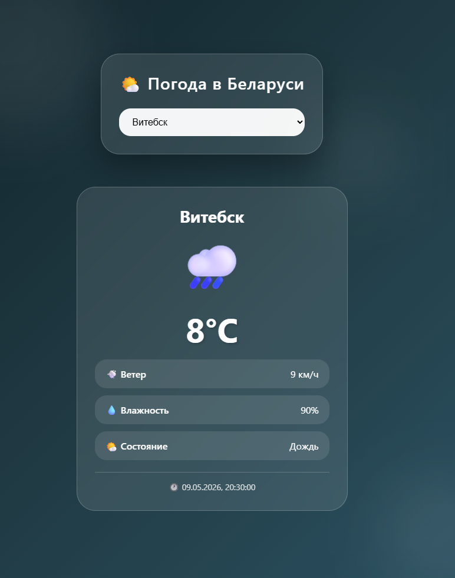

# 🌤️ Weather App — Belarus Cities

A simple and beautiful weather application for Belarusian cities. Built with **TypeScript** and powered by the free [Open-Meteo](https://open-meteo.com) API (no API key required).

---

## ✨ Features

- ✅ Select city from dropdown (6 Belarusian cities)
- ✅ Current temperature display
- ✅ Humidity and wind speed
- ✅ Weather condition (clear, cloudy, rain, snow)
- ✅ Last update time
- ✅ Weather icons for each condition
- ✅ Beautiful responsive design with animations
- ✅ Glassmorphism card style

---

## 🛠️ Tech Stack

- **TypeScript** — strict type checking
- **HTML5 / CSS3** — animations, responsive, glass effect
- **Open-Meteo API** — free weather API, no key needed
- **Fetch API** — async requests
- **Git / GitHub Pages** — deployment

---

## 📂 Project Architecture
src/
├── core/
│ ├── weatherService.ts # API requests
│ ├── types.ts # TypeScript interfaces
├── main.ts # App logic
index.html
style.css

text

---

## 🚀 Live Demo

[GitHub Pages Link]  
https://eventailer.github.io/Weather-App-Belarus-Cities-on-TS/

---

## 🖥️ Run Locally

```bash
# Clone the repository
git clone https://github.com/EvenTailer/Weather-App-Belarus-Cities-on-TS.git

# Navigate to folder
cd weather-app

# Install dependencies
npm install

# Compile TypeScript
npx tsc

# Start local server
npx lite-server
Open http://localhost:3000

📸 Screenshots

🔮 Future Improvements
"Feels like" temperature

7-day forecast

Air pressure and cloud cover

Search city by name

Auto-detect user location

Dark mode